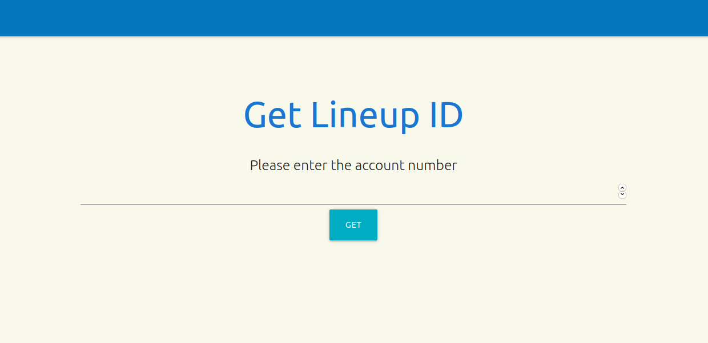

LDAP Service
====

LDAP Service 



## Setup

Create a new virtualenv and activate it
```bash
python3 -m venv .venv && source .venv/bin/activate
```

With a virtualenv activated install the dependencies
```bash
pip3 install --upgrade pip && pip3 install -r requirements/dev.txt
```

Set development environment variables

```bash
export FLASK_APP=ldap_service/app.py
export FLASK_ENV=development
```

## Running

```bash
flask run --host=0.0.0.0 --port=5000
```

Go to: [http://localhost:5000/get-lineupid](http://localhost:5000/get-lineupid)


## Running tests

```bash
pytest -v ldap_service/tests.py
```

## Using Docker

```bash
docker build -t ldap-service:latest .
```

```bash
docker run -p 8000:5000 ldap-service
```

Go to: [http://localhost:8000/get-lineupid](http://localhost:8000/get-lineupid)